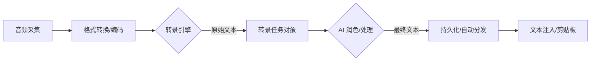

# 架构概览 (Shared Core)

## 概要说明

本文档提供 YakType 项目 **跨平台核心 (Shared Core)** 的系统架构全景视图。这些设计原则与组件在 macOS 及未来的 iOS 版本中通用。通过阅读本文档，您可以快速了解项目的核心设计模式（解耦与响应式）、底层技术栈分布、各核心业务模块的职责边界，以及数据从音频采集到 AI 处理并最终输出到系统的完整链路。

## 核心设计原则

1. **解耦性**：通过协议（Protocol）抽象音频采集与 AI 引擎，实现模块化替换。
2. **响应性**：基于 Combine 框架实现全链路状态监听，确保 UI 与任务进度的实时同步。
3. **数据一致性**：使用 SwiftData 管理任务历史与引擎配置，确保多窗口及进程间的状态对齐。

## 技术栈 (Technology Stack)

*   **UI 框架**：SwiftUI
*   **状态管理/异步编程**：Combine + Swift Concurrency (async/await)
*   **持久化层**：SwiftData
*   **音频采集/编解码**：AVFoundation (AVAudioEngine) + WebRTCCore + SwiftOGG
*   **系统交互**：Accessibility API (文本注入) + KeyboardShortcuts (全局热键)

## 核心模块职责

### 1. AudioManager
*   **职责**：硬件层交互。
*   **功能**：管理麦克风/系统音频采集、实时分贝监测、音频流格式转换（PCM 至 OGG/Opus）。

### 2. TranscriptionService
*   **职责**：业务逻辑转发与任务状态机管理。
*   **功能**：调度 `TranscriptionTask` 生命周期，驱动不同阶段（录制、转录、润色、完成）的状态切换，并处理异常中断。

### 3. SpeechEngine 抽象层
*   **职责**：引擎接口标准化。
*   **功能**：通过 `SpeechEngine` 协议规范 `transcribe` 与 `polish` 方法，隔离具体的 AI 模型实现（包括 Gemini 和 Apple Native 引擎）。

### 4. SpeechViewModel (macOS)
*   **职责**：视图层驱动与交互逻辑。
*   **功能**：绑定 Service 状态，控制悬浮窗 (HUD) 的生命周期，处理用户快捷键输入及权限检查。

### 5. MigrationManager
*   **职责**：数据库版本控制与自愈。
*   **功能**：管理 SwiftData 架构的版本迁移（Stored vs Current），在启动时执行数据一致性检查（Self-healing），确保关键引擎配置与流水线在升级后依然有效。

## 数据流转 (Data Pipeline)

1. **输入阶段**：`AudioManager` 通过 `AVAudioEngine` 捕获数据流，输出 OGG 格式文件。
2. **处理阶段**：`TranscriptionService` 调用配置的 `SpeechEngine` 进行 REST API 请求或本地推理。
3. **输出阶段**：处理完成后更新 `TranscriptionTask` 的 `status` 字段，并通过 `NotificationCenter` 和 `Combine` 触发 UI 更新。

## 目录结构

*   **`Sources/Shared` (Core Logic)**：跨平台核心业务逻辑、模型定义、持久化架构。这些代码在所有目标平台上共享。
*   **`Sources/macOS` (Platform Implementation)**：针对 macOS 的视图组件、视图模型、以及平台特有的 `NSPanel` 交互逻辑。
*   **`Sources/Resources`**：跨平台静态资源、多语言 L10n 文件。
