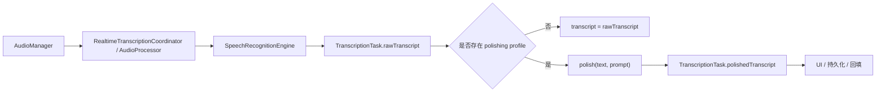
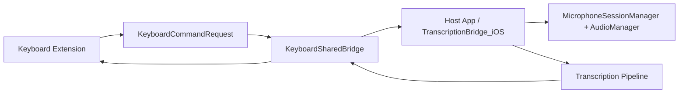

# 架构概览 (Shared Core)

## 概要说明

本文档基于当前 `yaktype/` 工程代码，概述 YakType 的共享核心架构、平台分层、关键模块职责以及从音频采集到文本回填的主链路。适用范围覆盖 `macOS` 主应用与 `iOS` 宿主 App / Keyboard Extension 的共用实现。

## 1. 架构定位

YakType 当前并不是“两个完全独立的 App”，而是共享一套 `Sources/Shared/` 领域模型与服务层，再由 `Sources/macOS/` 和 `Sources/iOS/` 承担各自的平台入口、UI 与系统交互。

当前代码事实：

- 共享核心位于 `yaktype/Sources/Shared/`
- `macOS` 平台层位于 `yaktype/Sources/macOS/`
- `iOS` 平台层位于 `yaktype/Sources/iOS/`
- WebRTC VAD 与信号处理位于 `yaktype/Sources/WebRTCCore/`

## 2. 核心设计原则

### 2.1 角色解耦

- 听写（dictation）与后处理（polishing）通过 `EngineRole`、`EngineType` 与 `ProcessingPipeline` 解耦。
- `SpeechRecognitionEngine` 只定义引擎契约，不绑定具体 Provider。
- 文本结果、引擎配置、提示词模板、密钥池均以独立 SwiftData 实体持久化。

### 2.2 平台共享，入口分离

- `macOS` 直接承载录音、任务处理、HUD 与全局快捷键。
- `iOS` 采用“宿主 App 持有热麦 + 键盘扩展发命令”的双进程协作模式。
- 双端共用 `AudioManager`、模型、引擎工厂、VAD、配置与同步基础设施。

### 2.3 配置优先于硬编码

- 工程结构由 `project.yml` + XcodeGen 驱动。
- 引擎参数由 `EngineProfileConfig` 管理。
- 默认提示词、默认流水线和系统命名通过 `AppInitializer` 种子逻辑生成或修复。

## 3. 技术栈

| 领域 | 当前实现 |
| :--- | :--- |
| UI | SwiftUI |
| 状态与异步 | Combine + Swift Concurrency |
| 持久化 | SwiftData |
| 音频 | AVFoundation + WebRTCCore + SwiftOGG |
| 跨进程桥接 | App Group `UserDefaults` + Darwin Notification |
| 系统集成 | Accessibility API、KeyboardShortcuts、App Intents |

## 4. 核心模块职责

### 4.1 `AudioManager`

职责：

- 管理麦克风输入与 iOS 音频会话
- 统一输出 16kHz、单声道音频
- 为实时听写和 warm mic 占用提供底层采集能力

相关代码：

- `yaktype/Sources/Shared/Services/AudioManager.swift`
- `yaktype/Sources/Shared/Services/AudioManager+InputCapture.swift`
- `yaktype/Sources/Shared/Services/AudioManager+iOSSession.swift`

### 4.2 `RealtimeTranscriptionCoordinator`

职责：

- 将连续音频按 VAD 和时长切成可提交的 segment
- 管理实时分段队列、在途 segment 与 drain 收口
- 把引擎状态回写为任务阶段

这是当前 Shared Core 中实时听写的关键编排器之一，而不是简单把整段录音一次性交给引擎。

### 4.3 引擎抽象层

由以下部分组成：

- `SpeechRecognitionEngine`
- `SpeechEngineFactory`
- `EngineProfileConfig`
- 具体实现：Apple / Gemini / Aliyun / MiMo / OpenAI Compatible

当前能力矩阵：

- `Apple`：仅听写
- `Gemini`：听写 + 后处理
- `AliCloud QwenASR`：仅听写
- `Xiaomi MiMo ASR`：仅听写
- `OpenAI (Compatible)`：仅后处理

### 4.4 模型与持久化层

当前 `AppModelSchema` 注册的实体有：

- `TranscriptionTask`
- `PromptTemplate`
- `EngineProfile`
- `ProcessingPipeline`
- `ManagedKey`

其中：

- `ManagedKey` 用于统一密钥池
- `EngineProfile` 通过 `managedKeyID` 间接引用密钥
- `PromptTemplate` 记录内置、订阅和用户模板元数据

### 4.5 平台桥接与控制层

`macOS` 侧：

- `SpeechViewModel`
- `MacOSHUDCoordinator`
- `MacOSShortcutCoordinator`
- `MacOSAutoInsertCoordinator`

`iOS` 侧：

- `TranscriptionBridge_iOS`
- `MicrophoneSessionManager`
- `KeyboardSharedBridge`
- `KeyboardDashboardModel`
- `AppViewModel`

## 5. 数据主链路

### 5.1 标准听写链路

### 5.2 iOS 键盘链路

## 6. 默认种子数据与系统预设

`AppInitializer` 会确保以下数据存在并与当前语言同步：

- 至少一个默认流水线
- iOS 下额外补齐左滑、右滑两条非默认流水线
- 一个系统 Apple 听写引擎
- 一个系统 Gemini 后处理引擎
- 两个内置提示词：
  - `Dictation Polishing`
  - `Chinese-to-English Translation`

这意味着“空库初始化”后的系统状态并不是完全空白，而是最小可运行基线。

## 7. 当前重要实现语义

### 7.1 三条物理流水线

在 iOS 当前实现中，点击、左滑、右滑已经不是“同一后处理引擎 + 不同 prompt slot”，而是三条独立的物理流水线：

- 默认点击流水线
- 左滑流水线
- 右滑流水线

每条流水线都可以绑定独立的后处理引擎实例。

### 7.2 Prompt 不再是历史记录主索引

`TranscriptionTask` 保留 `polishingPromptName` 仅为 schema 兼容字段。新任务记录的主上下文已经转为：

- `engineType`
- `dictationEngineProfileID`
- `polishingEngineProfileID`
- `polishingEngineType`
- `pipelineIndex`

### 7.3 统一密钥池

云端引擎配置支持：

- 直接内嵌 `apiKey`
- 或引用 `ManagedKey.id`

运行时以 `EngineProfile.resolveAPIKey(in:)` 解析最终密钥。

