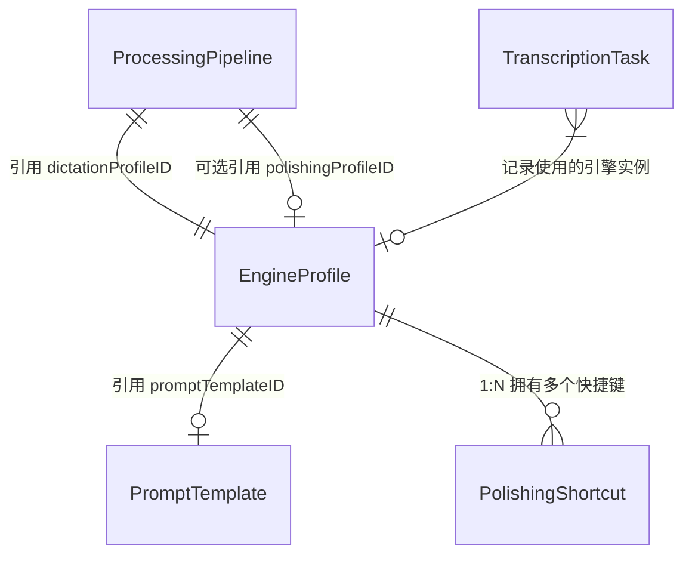

# 数据模型 (Shared Core)

## 概要说明

本文档详述了 YakType **跨平台核心 (Shared Core)** 中使用的 SwiftData 持久化模型。这些模型被 macOS 以及未来的 iOS 客户端共同使用。文档以类似数据库架构说明书的形式，列出了所有核心实体（TranscriptionTask, EngineProfile, PromptTemplate, ProcessingPipeline）的每一个属性、数据类型及其业务用途。

> [!TIP]
> 关于持久化存储的分层架构（SwiftData vs UserDefaults）以及 iCloud 同步细节，请参阅 [持久化架构与同步方案](Persistence-Schema.md)。

## 实体关系图 (ER Diagram)

---

## 1. TranscriptionTask (转录任务)

存储单次录音及其全生命周期处理结果的核心实体。

| 属性名 | 数据类型 | 描述 |
| :--- | :--- | :--- |
| `id` | `UUID` | 任务唯一标识符（主键）。 |
| `date` | `Date` | 任务创建/录音开始时间。 |
| `audioURLString` | `String` | 此任务关联的本地音频文件路径。 |
| `transcript` | `String` | 最终呈现给用户的文本内容（可能是原始文本，也可能是润色后的文本）。 |
| `rawTranscript` | `String` | 原始 ASR 转录文本。 |
| `polishedTranscript` | `String?` | AI 润色后的文本。若未进行润色则为 nil。 |
| `statusValue` | `String` | 任务状态。枚举值：`Recording`, `Transcribing`, `Completed`, `Error`。 |
| `engineType` | `String` | 执行转录的引擎类型（包括 "gemini" 和 "apple"）。 |
| `dictationEngineProfileIDString`| `String?` | 指向具体 `EngineProfile` 的 UUID 字符串。 |
| `polishingEngineProfileIDString`| `String?` | 指向具体润色引擎 `EngineProfile` 的 UUID 字符串。 |
| `polishingEngineType` | `String?` | 执行润色的引擎类型。 |
| **性能元数据** | | |
| `audioDuration` | `Double?` | 音频总时长（单位：秒）。 |
| `fileSize` | `Int64?` | 音频文件大小（字节）。 |
| `processingStartTime`| `Date?` | ASR 处理开始时间。 |
| `processingEndTime` | `Date?` | 所有处理（含润色）结束时间。 |
| `polishingStartTime` | `Date?` | AI 润色开始时间。 |
| `dictationDuration` | `Double?` | 纯转录环节耗时（秒）。 |
| `polishingDuration` | `Double?` | 纯润色环节耗时（秒）。 |
| **上下文信息** | | |
| `sourceAppBundleID` | `String?` | 触发录制时焦点应用的 Bundle ID。 |
| `sourceAppName` | `String?` | 触发录制时焦点应用的名称。 |

---

## 2. EngineProfile (引擎配置)

存储不同 AI 服务的访问凭证与参数。

| 属性名 | 数据类型 | 描述 |
| :--- | :--- | :--- |
| `id` | `UUID` | 配置文件唯一标识符。 |
| `name` | `String` | 用户定义的配置名称（例："My Gemini Pro"）。 |
| `kindValue` | `String` | 引擎技术类型。支持值：`gemini`, `aliyun`, `openAI`（macOS 还支持 `apple`）。 |
| `roleValue` | `String` | 引擎角色。支持值：`dictation` (转录), `polishing` (润色)。 |
| `promptTemplateIDString` | `String?` | 关联的 `PromptTemplate` UUID 字符串。 |
| `configData` | `Data` | 二进制 JSON 载荷，保存特定引擎的具体配置。当前云引擎配置支持 `managedKeyID`（UUID 字符串）用于引用统一密钥池，`apiKey` 保留为兼容字段。 |
| `isEnabled` | `Bool` | 是否激活该配置。 |
| `createdAt` | `Date` | 创建时间。 |
| `updatedAt` | `Date` | 最后修改时间。 |

---

## 3. PromptTemplate (提示词模板)

管理发送给大语言模型（LLM）的系统级指令。

| 属性名 | 数据类型 | 描述 |
| :--- | :--- | :--- |
| `id` | `UUID` | 模板唯一标识符。 |
| `name` | `String` | 模板显示名称。 |
| `systemInstruction` | `String` | 实际发送给 AI 的指令内容（Prompt）。 |
| `lastModified` | `Date` | 最后修改时间。 |

---

## 3.1 初始化策略（提示词）

当前初始化策略为：
- 当提示词库为空时，直接调用“恢复内置提示词”逻辑导入内置集合（当前为两条）。
- 不再插入历史上的“单条默认提示词”作为初始化路径。

---

## 4. ProcessingPipeline (处理流水线)

定义了如何组合转录与润色引擎的工作流。

| 属性名 | 数据类型 | 描述 |
| :--- | :--- | :--- |
| `id` | `UUID` | 流水线唯一标识符。 |
| `name` | `String` | 流水线名称。 |
| `dictationEngineProfileIDString`| `String` | 绑定的转录引擎配置 ID 字符串。 |
| `polishingEngineProfileIDString`| `String?` | 绑定的可选润色引擎配置 ID 字符串。 |
| `isDefault` | `Bool` | 是否为当前系统默认使用的流水线。 |
| `createdAt` | `Date` | 创建时间。 |
| `updatedAt` | `Date` | 最后修改时间。 |

---

## 5. PolishingShortcut (润色快捷键)

用于将全局按键组合映射到特定的润色引擎与提示词组合。

| 属性名 | 数据类型 | 描述 |
| :--- | :--- | :--- |
| `id` | `UUID` | 快捷键唯一标识符。 |
| `shortcutName` | `String` | `KeyboardShortcuts.Name` 对应的标识字符串。 |
| `promptID` | `UUID?` | 此快捷键触发时使用的具体 `PromptTemplate` ID。 |
| `isEnabled` | `Bool` | 该快捷键是否处于激活状态。 |
| `engineProfile` | `Relationship` | 反向关联所属的 `EngineProfile`。 |

---

## 6. ManagedKey（统一密钥池，非 SwiftData）

`ManagedKey` 当前不走 SwiftData，而是通过共享 `UserDefaults`（App Group）持久化，用于跨引擎复用凭证。

| 字段 | 类型 | 描述 |
| :--- | :--- | :--- |
| `id` | `UUID` | 密钥唯一标识，用于与引擎配置关联。 |
| `name` | `String` | 展示名称（用户可读）。 |
| `secret` | `String` | API Key 原文。 |
| `createdAt` | `Date` | 创建时间。 |
| `updatedAt` | `Date` | 更新时间。 |

关联规则：
- 引擎配置在 `configData` 中保存 `managedKeyID`。
- 运行时优先按 `managedKeyID` 解析密钥；若未命中则回退 legacy `apiKey`。
