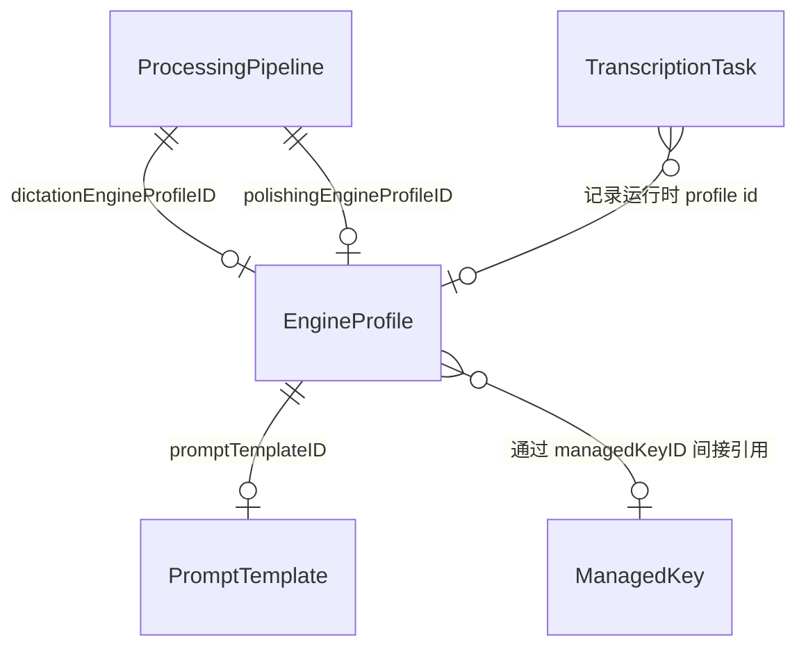

# 数据模型 (Shared Core)

## 概要说明

本文档基于 `yaktype/Sources/Shared/Models` 的当前实现，说明 YakType 使用的 SwiftData 实体、实体关系、关键字段语义以及与运行时逻辑相关的兼容字段。它描述的是“现行 schema”，不是历史设想。

## 1. Schema 注册范围

当前 `AppModelSchema` 注册的实体共有 5 个：

1. `TranscriptionTask`
2. `PromptTemplate`
3. `EngineProfile`
4. `ProcessingPipeline`
5. `ManagedKey`

## 2. 实体关系图

## 3. `TranscriptionTask`

单次录音与处理结果的历史记录实体。

### 3.1 关键字段

| 字段 | 类型 | 说明 |
| :--- | :--- | :--- |
| `id` | `UUID` | 主键 |
| `date` | `Date` | 任务创建时间 |
| `audioURLString` | `String` | 音频文件路径字符串 |
| `transcript` | `String` | 当前最终展示文本 |
| `rawTranscript` | `String` | 原始听写文本 |
| `polishedTranscript` | `String?` | 后处理结果 |
| `statusValue` | `String` | 对应 `TaskStatus.rawValue` |
| `engineType` | `String` | 听写引擎类型显示值 |
| `dictationEngineProfileIDString` | `String?` | 听写 profile UUID 字符串 |
| `polishingEngineProfileIDString` | `String?` | 后处理 profile UUID 字符串 |
| `polishingEngineType` | `String?` | 后处理引擎类型显示值 |
| `pipelineIndex` | `Int` | 当前任务所用流水线索引，默认 `0` |

### 3.2 任务状态

`TaskStatus` 当前值：

- `Recording`
- `Transcribing`
- `Completed`
- `SavedOnly`
- `Error`

其中：

- `SavedOnly` 表示任务被保存，但没有进入完整成功展示路径，常见于某些保底/兼容分支。
- 历史文档中若仅提及 `Recording / Transcribing / Completed / Error`，已经过时。

### 3.3 元数据字段

| 字段 | 类型 | 说明 |
| :--- | :--- | :--- |
| `audioDuration` | `Double?` | 音频总时长（秒） |
| `fileSize` | `Int64?` | 音频文件大小 |
| `processingStartTime` | `Date?` | 处理开始时间 |
| `processingEndTime` | `Date?` | 处理结束时间 |
| `polishingStartTime` | `Date?` | 后处理开始时间 |
| `dictationDuration` | `Double?` | 听写耗时 |
| `polishingDuration` | `Double?` | 后处理耗时 |
| `dictationCharacterCount` | `Int` | 听写文本字数 |
| `dictationErrorMessage` | `String?` | 听写错误信息 |
| `polishingErrorMessage` | `String?` | 后处理错误信息 |
| `sourceAppBundleID` | `String?` | 触发任务时的来源应用 Bundle ID |
| `sourceAppName` | `String?` | 触发任务时的来源应用名 |

### 3.4 兼容字段

`polishingPromptName` 仍存在，但仅为旧 schema 兼容保留。当前任务上下文的主事实来源已经是“引擎 profile + pipeline index”，而不是 prompt 名称。

## 4. `EngineProfile`

引擎实例配置实体，用于保存“某个具体 Provider + 角色 + 参数组合”的长期配置。

### 4.1 主字段

| 字段 | 类型 | 说明 |
| :--- | :--- | :--- |
| `id` | `UUID` | 主键 |
| `name` | `String` | 用户可见名称 |
| `kindValue` | `String` | 引擎类型，对应 `EngineType.rawValue` |
| `roleValue` | `String` | 角色，对应 `EngineRole.rawValue` |
| `promptTemplateIDString` | `String?` | 绑定的提示词模板 |
| `mainShortcutName` | `String?` | 主快捷键名，供部分 UI/同步语义使用 |
| `systemPresetKey` | `String?` | 系统预设键，用于本地化系统命名 |
| `configData` | `Data` | `EngineProfileConfig` 编码后的 JSON |
| `isEnabled` | `Bool` | 是否启用 |
| `createdAt` | `Date` | 创建时间 |
| `updatedAt` | `Date` | 更新时间 |

### 4.2 角色与类型

当前 `EngineRole`：

- `dictation`
- `polishing`

当前 `EngineType`：

- `Apple`
- `Gemini`
- `AliCloud QwenASR`
- `Xiaomi MiMo ASR`
- `OpenAI (Compatible)`

能力边界：

- `Apple` / `Aliyun` / `MiMo`：仅 `dictation`
- `OpenAI`：仅 `polishing`
- `Gemini`：同时支持两种角色

### 4.3 `EngineProfileConfig`

当前配置枚举：

- `.apple(AppleEngineConfig)`
- `.gemini(GeminiEngineConfig)`
- `.aliyun(AliyunEngineConfig)`
- `.mimo(MimoEngineConfig)`
- `.openAI(OpenAIEngineConfig)`

其中云端配置普遍支持两套密钥输入方式：

- `apiKey`：兼容老数据
- `managedKeyID`：指向统一密钥池

## 5. `ProcessingPipeline`

流水线实体，用于定义“一个听写 profile + 一个可选后处理 profile”的组合。

### 5.1 主字段

| 字段 | 类型 | 说明 |
| :--- | :--- | :--- |
| `id` | `UUID` | 主键 |
| `name` | `String` | 流水线名称 |
| `dictationEngineProfileIDString` | `String?` | 绑定的听写 profile |
| `polishingEngineProfileIDString` | `String?` | 绑定的后处理 profile |
| `systemPresetKey` | `String?` | 系统预设键 |
| `isDefault` | `Bool` | 是否默认流水线 |
| `createdAt` | `Date` | 创建时间 |
| `updatedAt` | `Date` | 更新时间 |

### 5.2 当前运行语义

- 默认流水线用于点击触发
- iOS 下非默认流水线按创建顺序映射为左滑、右滑
- `TranscriptionPipelineResolver` 在索引 `0 / 1 / 2` 时分别解析默认、左滑、右滑流水线

## 6. `PromptTemplate`

提示词模板实体，既支持用户自建，也支持系统内置与订阅导入。

### 6.1 主字段

| 字段 | 类型 | 说明 |
| :--- | :--- | :--- |
| `id` | `UUID` | 主键 |
| `name` | `String` | 展示名称 |
| `systemInstruction` | `String` | 原始提示词正文 |
| `lastModified` | `Date` | 最后更新时间 |
| `version` | `String?` | 模板版本 |
| `model` | `String?` | 模型标签 |
| `externalUUID` | `String?` | 远端或内置模板稳定标识 |
| `source` | `String?` | `builtin` / `subscription` / `user` |
| `systemPresetKey` | `String?` | 系统模板预设键 |

### 6.2 当前行为语义

- `source == "builtin"` 或 `source == "subscription"` 时视为只读
- 内置模板会通过 `resolvedSystemInstruction` 返回本地化后的最终正文
- 当前内置模板有两个：
  - `Dictation Polishing`
  - `Chinese-to-English Translation`

## 7. `ManagedKey`

统一密钥池实体。

| 字段 | 类型 | 说明 |
| :--- | :--- | :--- |
| `id` | `UUID` | 主键 |
| `name` | `String` | 用户命名 |
| `secret` | `String` | 密钥明文 |
| `createdAt` | `Date` | 创建时间 |
| `updatedAt` | `Date` | 更新时间 |

说明：

- `EngineProfile` 不直接持久化对 `ManagedKey` 的外键关系，而是把 `managedKeyID` 编入具体 config。
- 删除密钥前，UI 会先通过 `ManagedKeyDomainService.referencingProfiles` 检查引用关系。

