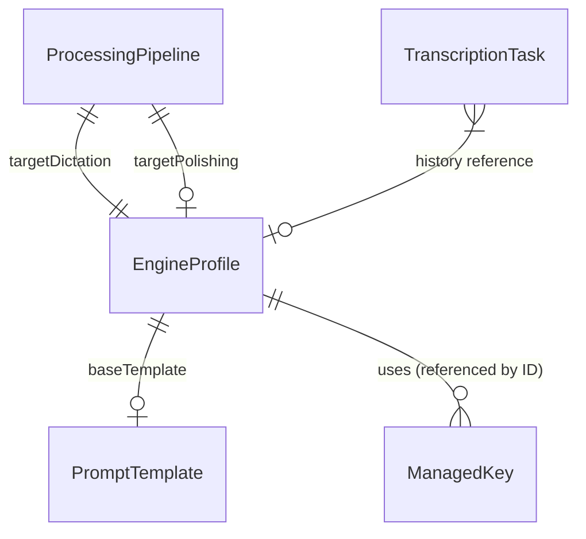

# 持久化架构与同步方案 (Persistence & Sync Schema)

本文档详细描述了 YakType 项目的数据存储策略，涵盖了本地数据库 (SwiftData)、共享首选项 (UserDefaults) 以及跨设备同步方案 (iCloud JSON)。

## 1. 存储层级概览 (Architecture Layers)

YakType 采用多层持久化方案，以平衡性能、跨进程访问需求以及云同步的原子性。

| 存储引擎 | 物理位置 | 访问域 | 主要用途 |
| :--- | :--- | :--- | :--- |
| **SwiftData (SQLite)** | `Application Support/default.sqlite` | App 主进程 | 核心业务实体（历史记录、引擎配置、提示词模板）。 |
| **Shared Defaults** | `UserDefaults (Suite: group.com.yaktype.shared)` | App + 键盘扩展 | 跨进程共享配置（开关状态、当前选中的引擎 ID）。 |
| **Local Defaults** | `UserDefaults.standard` | App 主进程 | 设备特定或 UI 状态（是否完成引导、Dock 图标显示）。 |
| **iCloud Sync** | `iCloud Documents/YakTypeSync.json` | 跨设备 | 配置文件的原子性跨设备迁移。 |

---

## 2. 实体关系与存储映射 (Mapping Table)

下表列出了核心数据项及其所属的存储引擎与同步状态：

| 类别 | 数据项 | 存储引擎 | 云同步? | 说明 |
| :--- | :--- | :--- | :--- | :--- |
| **业务历史** | `TranscriptionTask` | SwiftData | ❌ 否 | 包含录音文件路径与本地文本，暂不同步。 |
| **引擎管理** | `EngineProfile` | SwiftData | ✅ 是 | 包含引擎类型、Role、参数配置。 |
| | `ManagedKey` | SwiftData | ✅ 是 | **[新]** 已从 UserDefaults 迁移至 SwiftData。 |
| **流水线** | `ProcessingPipeline` | SwiftData | ✅ 是 | 定义转录+润色的组合。 |
| **内容指令** | `PromptTemplate` | SwiftData | ✅ 是 | AI 润色所用的系统提示词。 |
| **系统配置** | `App Language` | UserDefaults | ✅ 是 | 保持各设备 UI 语言一致。 |
| | `Auto-Delete Policy` | UserDefaults | ✅ 是 | 记录清理策略。 |
| **状态/环境**| `Onboarding Status` | UserDefaults | ❌ 否 | 每台设备需独立完成引导。 |
| | `Audio Device ID` | UserDefaults | ❌ 否 | 不同设备的硬件标识符不同。 |

---

## 3. 详细模式说明 (Detailed Schema)

### 3.1 SwiftData 实体

> [!IMPORTANT]
> **ManagedKey 存储安全**：
> `ManagedKey.secret` 目前在数据库中进行存储。为了安全起见，引擎配置 (`EngineProfile`) 仅通过 UUID 引用 Key 池中的项，不直接持有密钥字符串。

### 3.2 UserDefaults (App Group)

所有涉及键盘扩展（Keyboard Extension）访问的配置均存储在 `group.com.yaktype.shared` 中：
* `selectedEngineType`: 当前全局激活的引擎类型。
* `isCloudSyncEnabled`: 同步总开关。
* `pipelineDictationEngineType`: iOS 侧滑动触发的专用引擎映射。

---

## 4. iCloud 同步逻辑 (CloudSyncManager)

### 4.1 同步周期
* **导出 (Export)**：当应用切入后台 (`.background`)、配置变更或用户手动点击“同步”。采用 5 秒防抖处理。
* **导入 (Import)**：当应用启动、从后台切回前台 (`.active`)。

### 4.2 冲突解决
* **策略**：**最后更新者胜 (Last Writer Wins)**。
* **逻辑**：每个 DTO 对象均包含 `updatedAt` 时间戳。同步时，若云端文件中的时间戳晚于本地实体，则执行 `update(from:)`；否则保留本地。

### 4.3 目录可见性
同步文件路径为：`iCloud Drive/YakType/YakTypeSync.json`。
用户可以通过文件应用或 Finder 手动查看同步内容。

---

## 5. 迁移历史 (Migration Notes)

* **v0.2.0**: `ManagedKey` 从 `UserDefaults` 重构并迁移至 `SwiftData`。应用启动时，`AppInitializer` 会自动扫描旧的 `AppGroup` 存储并将其平滑迁移至数据库。

---

> [!NOTE]
> 开发者如需添加新的配置项，应根据该项是否需要被键盘访问来决定选择 `sharedDefaults` 还是 `standard`。
