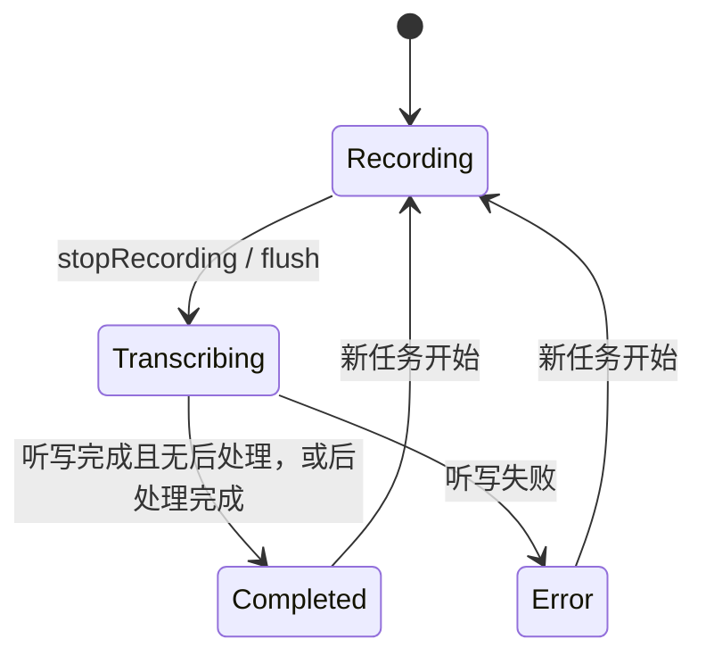

# 核心状态机 (Shared Core)

## 概要说明

本文档基于当前 Shared Core 与 iOS 键盘桥接实现，说明 YakType 的任务状态、会话状态以及它们如何映射到 UI。这里不只包含 `TranscriptionTask.TaskStatus`，也包含 iOS 端的 `KeyboardSessionState`。

## 1. 任务状态：`TranscriptionTask.TaskStatus`

当前任务状态枚举定义于 `TranscriptionTask.swift`：

- `Recording`
- `Transcribing`
- `Completed`
- `SavedOnly`
- `Error`

### 1.1 语义

| 状态 | 含义 |
| :--- | :--- |
| `Recording` | 正在采集音频，或者实时分段仍在持续回流 |
| `Transcribing` | 录音已结束，正在听写或等待实时 segment drain |
| `Completed` | 听写成功完成，若存在后处理则也已结束 |
| `SavedOnly` | 任务已保存，但没有走完整成功展示链路 |
| `Error` | 听写或后处理失败 |

## 2. 引擎状态：`SpeechEngineStatus`

引擎级状态只有四个：

- `idle`
- `processing`
- `ready`
- `error(String)`

这组状态比任务状态更底层。Shared Core 会把引擎状态转换成任务状态和桥接状态，而不会直接把引擎状态原样展示给用户。

## 3. 共享任务主链路

说明：

- 当前 `TaskStatus` 并没有单独的 `Polishing` 状态。
- 后处理阶段通常仍折叠在 `Transcribing` 的处理中语义里，由 UI 层结合上下文显示“正在整理文本”等提示。

## 4. iOS 键盘会话状态：`KeyboardSessionState`

当前会话状态：

- `idle`
- `armed`
- `starting`
- `recording`
- `stopping`
- `finalizing`
- `completed`
- `error`

### 4.1 状态语义

| 状态 | 含义 |
| :--- | :--- |
| `idle` | 热麦未占用 |
| `armed` | 热麦已占用，等待开始录音 |
| `starting` | 开始命令已接收，等待录音稳定 |
| `recording` | 正在录音 |
| `stopping` | 停止命令已接收，录音收口中 |
| `finalizing` | 录音结束，仍在听写/后处理中 |
| `completed` | 本轮结果可供键盘消费或注入 |
| `error` | 本轮处理失败 |

### 4.2 辅助语义

`KeyboardSessionState` 还定义了几组派生语义：

- `isActivePhase`
- `isInteractiveProcessingPhase`
- `isTerminalPhase`
- `isIdleLikePhase`
- `keepsOwnershipWhileActive`
- `publishesCompletedOwnership`

这些派生语义被 `KeyboardSessionPolicy` 用于决定：

- 是否允许继续交互
- 是否保留 owner
- 是否允许填回最终文本
- 是否需要轮询完成兜底

## 5. 状态映射关系

### 5.1 Shared Core 到键盘桥接

在 iOS 桥接里，会把任务和占用状态折叠成键盘可消费的 `KeyboardSessionState`：

- 未占用热麦：`idle`
- 已占用但未录音：`armed`
- 刚启动录音：`starting`
- 正在录音：`recording`
- 已停止录音但结果未完成：`stopping` / `finalizing`
- 任务完成：`completed`
- 任务失败：`error`

### 5.2 UI 展示层

当前 UI 不是直接暴露所有底层状态，而是映射为用户能理解的文案，例如：

- 录音中：`Recording...`
- 处理中：`Organizing text...`
- 完成：`AI polishing complete`
- 失败：引导返回主 App 查看详情

## 6. 所有权与幂等

键盘桥接状态机的核心不是“能否切状态”，而是“谁拥有当前会话”和“最终文本是否已经消费”。

### 6.1 所有权

- 活跃阶段通过 `owningInstanceID` / `activeSessionID` 绑定 owner
- 终态通过 `completedSessionID` 公布结果归属
- `host` owner 不接受键盘 stop/abort 命令

### 6.2 幂等注入

键盘仅在以下条件成立时注入最终文本：

1. `sessionState` 为终态
2. `completedSessionID == localInstanceID`
3. `finalTranscriptID` 尚未消费

这样可以避免同一份最终结果被重复插入目标输入框。

