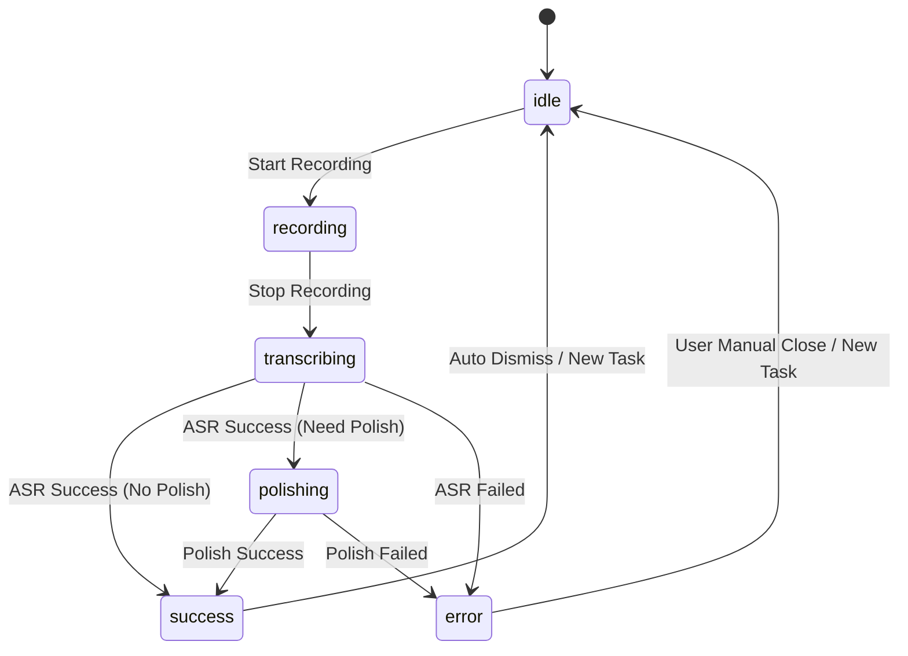

# 核心状态机 (Shared Core)

## 概要说明

本文档详细描述 YakType 内部核心任务处理的状态流转逻辑。通过阅读本文档，您可以了解转录任务从启动到结束的完整生命周期、内部定义的各种处理阶段（ProcessingPhase）、状态切换的触发条件，以及 Service 层状态如何同步至 UI 层（HUD 悬浮窗）。

## 核心阶段定义 (ProcessingPhase)

`TranscriptionService` 内部使用 `ProcessingPhase` 枚举来驱动整个处理流程。

| 状态 (Phase) | 说明 | 触发动作 |
| :--- | :--- | :--- |
| `idle` | 静默/就绪状态 | 系统初始化或任务彻底结束。 |
| `recording` | 正在采集音频数据 | 用户启动录音。 |
| `transcribing` | 正在进行语音转文字 (ASR) | 录音停止，开始调用转录引擎。 |
| `polishing` | 正在进行 AI 文本润色/优化 | 转录成功，开始调用 LLM 引擎。 |
| `success` | 任务成功完成 (终端状态) | 所有配置的处理环节均已成功并输出结果。 |
| `error` | 任务失败 (终端状态) | 任意环节发生异常（如权限被拒绝、网络中断或 API 认证失败）。 |

## 状态流转图 (State Transitions)

## UI 状态同步机制

`SpeechViewModel` 通过 Combine 框架监听 `TranscriptionService.shared.$processingPhase` 的变化，并将其映射为 `FloatingPanelState`。

### 状态映射逻辑：
1. **`recording`**：同步更新 `currentTaskDuration`，HUD 显示波形与录音时长。
2. **`transcribing` / `polishing`**：HUD 进入处理中 (Processing) 模式，显示对应的进度提示语。
3. **`success` / `error`**：HUD 显示最终结果并启动自动隐藏计时器（成功 1.25s，失败 3.5s）。

## 关键判定逻辑

*   **润色判定**：在 `handleDictationReady` 阶段，Service 会检查当前 `ProcessingPipeline` 是否配置了有效的 `polishingEngineProfileID`。如果未配置，直接由 `transcribing` 跳至 `success`。
*   **状态锁定**：在 `success` 或 `error` 阶段，HUD 会忽略无关的中间状态更新，直至计时器触发或新任务强制重置，以避免 UI 闪烁。
