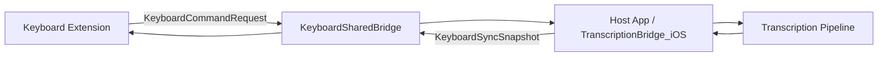
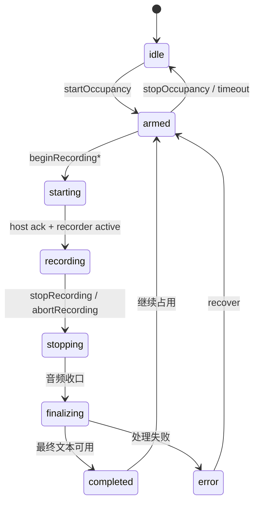

# YakType iOS 主 App 与键盘扩展通信机制与状态机

## 概要说明

本文档基于当前 `KeyboardSharedBridge`、`KeyboardDashboardModel` 与 iOS 宿主桥接实现，说明 YakType iOS 端的命令协议、状态快照、所有权规则、可靠性机制与三条流水线语义。

## 1. 总体模型

YakType iOS 采用“宿主持有资源，键盘发起动作”的双进程模型：

- 宿主 App 持有热麦、录音与处理主链路
- 键盘扩展负责交互、命令与文本注入
- 双端通过 App Group + Darwin Notification 共享状态

## 2. 共享容器与通知

### 2.1 App Group

- `group.com.yaktype.shared`

### 2.2 通知名

- `com.yaktype.shared.keyboard-command-sent`
- `com.yaktype.keyboard-pulse`
- `com.yaktype.shared.host-status-changed`

### 2.3 关键共享键

- `keyboard.syncSnapshot`
- `keyboard.pendingRequest`
- `keyboard.pendingRequestQueue`
- `keyboard.debugLog`
- `keyboard.localInstanceID`
- `keyboard.lastHandledFinalTranscriptID`
- `keyboard.lastSeenTimestamp`
- `keyboard.reportedFullAccess`

## 3. 协议版本

当前桥接协议版本：

- `KeyboardSharedBridge.protocolVersion == 2`

协议 v2 相对早期实现的重要变化：

1. 命令支持队列模式，不再只依赖单槽 `pendingRequest`
2. 命令带 `expiresAt`，可丢弃过期命令
3. 快照增加 `schemaVersion`、`snapshotID`、`generatedAt`
4. owner 校验比旧实现更严格

## 4. 键盘到宿主：`KeyboardCommandRequest`

### 4.1 字段

| 字段 | 说明 |
| :--- | :--- |
| `schemaVersion` | 协议版本 |
| `senderInstanceID` | 键盘实例标识 |
| `command` | 命令类型 |
| `pipelineIndex` | 目标流水线索引 |
| `commandID` | 命令唯一 ID |
| `timestamp` | 发送时间 |
| `expiresAt` | 命令过期时间 |

### 4.2 命令集合

- `beginRecording`
- `beginRecordingPipeline1`
- `beginRecordingPipeline2`
- `stopRecording`
- `abortRecording`

### 4.3 当前语义

- 开始录音时，点击/左滑/右滑分别对应不同 begin 命令
- 停止录音时会把 `intendedPipeline.index` 作为 `pipelineIndex` 回传
- 取消录音使用 `abortRecording`

## 5. 宿主到键盘：`KeyboardSyncSnapshot`

### 5.1 字段分类

元信息：

- `schemaVersion`
- `snapshotID`
- `generatedAt`

会话态：

- `sessionState`
- `isOccupied`
- `remainingSeconds`

文本态：

- `transcript`
- `finalTranscript`
- `finalTranscriptID`

控制与错误：

- `lastError`
- `lastProcessedCommandID`

所有权：

- `owningInstanceID`
- `activeSessionID`
- `completedSessionID`

宿主可用性：

- `hostHeartbeat`
- `hostAppState`

流水线展示：

- `defaultPipelineName`
- `pipeline1Name`
- `pipeline2Name`

### 5.2 当前流水线展示语义

这些名称字段面向键盘 UI，不等同于 prompt 名称。当前实现里它们用于表达“该入口触发的流水线标签或当前后处理引擎展示名”。

## 6. 三条流水线语义

当前 `pipelineIndex` 语义如下：

- `0` 或 `nil`：默认点击流水线
- `1`：左滑流水线
- `2`：右滑流水线

这里的“流水线”是物理流水线，不再是旧设计里的“同一引擎 + 不同 prompt slot 覆盖”。

## 7. 会话状态机

## 8. 所有权与授权

### 8.1 Owner 规则

- 活跃态通过 `owningInstanceID` 持有 owner
- 终态通过 `completedSessionID` 公布结果归属
- `host` owner 代表宿主主动发起的会话

### 8.2 命令授权

`KeyboardSessionPolicy.isCommandAuthorized(ownerID:senderID:)` 的当前逻辑：

- 无 owner 时，任何命令都可接受
- owner 为 `host` 时，键盘命令被拒绝
- 有键盘 owner 时，`senderID` 必须与 owner 严格一致

这意味着缺少 `senderInstanceID` 的 stop/abort 命令在当前实现里不再被宽松接受。

## 9. 可靠性机制

### 9.1 命令去重与过期

宿主侧 `KeyboardCommandObserver` 会：

- 用 `lastHandledCommandID` 去重
- 丢弃 `isExpired == true` 的命令
- 优先消费 `pendingRequestQueue`
- 必要时回退到旧版 `pendingRequest`

### 9.2 双心跳

- 键盘录音阶段发送 pulse
- 宿主发布带 `hostHeartbeat` 的快照

### 9.3 宿主看门狗

当宿主检测到“键盘拥有的录音会话长时间没有 pulse”时，会自动 stop 或 abort，避免键盘被系统回收后宿主继续悬空录音。

### 9.4 Zombie 会话清理

键盘侧若发现：

- 自己认为仍在录音
- 但 `activeSessionID` 已属于其他实例

会尝试发出 `abortRecording` 清理僵尸会话。

## 10. 幂等注入规则

键盘执行最终文本注入前，至少需要同时满足：

1. `sessionState` 为终态
2. `completedSessionID == localInstanceID`
3. `finalTranscriptID` 尚未处理

这是当前“同一结果只注入一次”的主防线。

