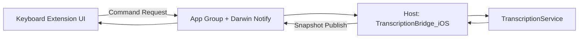
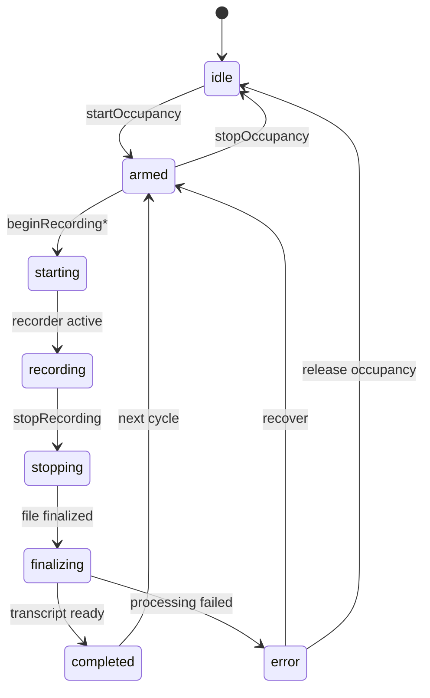

# YakType iOS 主 App 与键盘扩展通信机制与状态机

## 概要说明

本文档梳理 YakType iOS 当前实现中的 Host App（宿主）与 Keyboard Extension（键盘扩展）之间的通信协议、状态同步机制、关键状态机与故障兜底策略。目标是为后续开发和排障提供统一技术参考。

补充说明：2026-04-08 起，iOS 端后处理链路已从“单后处理引擎 + 多 slot prompt”重构为“点击 / 左滑 / 右滑三条独立物理流水线，各自绑定一个后处理引擎”。键盘协议不变，但 `pipelineIndex` 的语义现在直接对应具体流水线。

适用范围：
- `yaktype/Sources/iOS/TranscriptionBridge_iOS.swift`
- `yaktype/Sources/iOS/Keyboard/KeyboardDashboardModel.swift`
- `yaktype/Sources/Shared/Services/KeyboardSharedBridge.swift`
- `yaktype/Sources/Shared/Services/MicrophoneSessionManager.swift`
- `yaktype/Sources/Shared/Services/TranscriptionService.swift`

## 1. 总体架构

YakType iOS 采用“宿主占用麦克风 + 键盘发命令触发录音”的双进程协作模型：

- 宿主 App：
  - 管理热麦占用（Warm Mic）
  - 持有转写服务与引擎（`TranscriptionService`）
  - 对外发布状态快照（snapshot）
- 键盘扩展：
  - 负责用户交互（点击/滑动/停止）
  - 向宿主发送命令（command）
  - 消费宿主快照并驱动 UI

## 2. 通信通道与数据载体

## 2.1 共享容器

- App Group: `group.com.yaktype.shared`
- 共享存储：`UserDefaults(suiteName:)`
- 封装入口：`KeyboardSharedBridge.sharedDefaults`

## 2.2 Darwin 通知

当前使用三类通知名：
- `com.yaktype.shared.keyboard-command-sent`：键盘 -> 宿主（有新命令）
- `com.yaktype.shared.host-status-changed`：宿主 -> 键盘（有新快照）
- `com.yaktype.keyboard-pulse`：键盘心跳脉冲（用于宿主看门狗）

## 2.3 共享 Key

- `keyboard.pendingRequest`：键盘写入待处理命令
- `keyboard.pendingRequestQueue`：命令队列（v2+，降低覆盖丢命令风险）
- `keyboard.syncSnapshot`：宿主写入最新状态快照
- `keyboard.localInstanceID`：键盘本地会话身份标识
- `keyboard.lastHandledFinalTranscriptID`：键盘侧最终文本幂等消费标记
- `keyboard.debugLog`：调试日志

## 3. 协议定义（字段级）

注：当前实现已进入协议版本化阶段（Protocol v2），新增字段均要求向后兼容解码。

## 3.1 Keyboard -> Host 命令协议

结构体：`KeyboardCommandRequest`
- `schemaVersion`: 协议版本
- `senderInstanceID`: 发送端实例 ID（用于后续 owner 校验）
- `command`: `beginRecording / beginRecordingPipeline1 / beginRecordingPipeline2 / stopRecording / abortRecording`
- `pipelineIndex`: pipeline 序号（可空）
  - `nil / 0`：默认点击链路
  - `1`：左滑链路
  - `2`：右滑链路
- `commandID`: 命令唯一 ID（用于 ack）
- `timestamp`
- `expiresAt`: 命令过期时间（TTL 控制）

特点：
- 命令优先写入 `pendingRequestQueueKey`（队列模式），并兼容回写 legacy 单槽 `pendingRequestKey`。
- 宿主 `KeyboardCommandObserver` 去重处理（按 `lastHandledCommandID`）。
- 宿主会丢弃已过期命令（避免重启后重放陈旧命令）。

## 3.2 Host -> Keyboard 快照协议

结构体：`KeyboardSyncSnapshot`

关键字段：
- 协议元信息：`schemaVersion`、`snapshotID`、`generatedAt`
- 会话状态：`sessionState`（`KeyboardSessionState`）
- 热麦状态：`isOccupied`、`remainingSeconds`
- 文本相关：`transcript`、`finalTranscript`、`finalTranscriptID`
- 错误与 ack：`lastError`、`lastProcessedCommandID`
- 会话归属：`owningInstanceID`、`activeSessionID`、`completedSessionID`
- 可用性心跳：`hostHeartbeat`、`hostAppState`
- 扩展 UI 辅助：`pipeline1Name`、`pipeline2Name`

这两个名称字段的当前来源：
- `pipeline1Name`：左滑物理流水线当前选中后处理引擎的展示名（优先 prompt 名称，缺省回退到引擎名）
- `pipeline2Name`：右滑物理流水线当前选中后处理引擎的展示名（优先 prompt 名称，缺省回退到引擎名）

## 4. 主流程（时序）

## 4.1 键盘发起录音

1. 键盘点击主按钮，生成 `commandID`，发送 `beginRecording*`。
2. 键盘本地先进入 `.starting`，并设置 5 秒命令确认窗口。
3. 宿主接收命令：
   - 记录 `lastProcessedCommandID`
   - 设置 `owningInstanceID = senderInstanceID`
   - 调用 `handleStartRecording()`
4. 宿主发布快照，键盘看到 `lastProcessedCommandID == pendingCommandID`，确认 ack。
5. 转入 `.recording` 并开始周期心跳。

链路选择补充：
- 默认点击始终走默认流水线。
- 左滑 / 右滑始终走各自的物理流水线，不再从默认后处理引擎里读取 slot prompt 覆盖。
- `TranscriptionService` 会按 `pipelineIndex` 直接解析该流水线绑定的听写 / 后处理引擎。

## 4.2 键盘停止录音

1. 键盘发送 `stopRecording`（可附 pipelineIndex）。
2. 宿主进入 `.stopping`，调用 `TranscriptionService.stopRecording()`。
3. 服务层进入转写/后处理阶段，快照状态推进到 `.finalizing`。
4. 处理成功后进入 `.completed`，写入 `finalTranscript + finalTranscriptID`。
5. 键盘在 `completedSessionID == localInstanceID` 且 `finalTranscriptID` 未消费时执行幂等注入。

## 4.3 宿主主动录音（非键盘触发）

- 主 App 通过 `startRecordingFromHost()/stopRecordingFromHost()` 走同一桥接，但 `owningInstanceID` 固定为 `"host"`。
- 键盘侧会话冲突判断会排除 `"host"` 会话，避免误判 zombie。

## 5. 状态机设计

## 5.1 跨端会话状态机（KeyboardSessionState）

状态集合：
`idle -> armed -> starting -> recording -> stopping -> finalizing -> completed`，异常分支 `error`。

语义：
- `idle`：未占用热麦
- `armed`：已占用，等待开始
- `starting`：收到开始命令，等待录音稳定
- `recording`：录音中
- `stopping`：收到停止命令，正在收口
- `finalizing`：转写/后处理中
- `completed`：本轮完成，可注入最终文本
- `error`：本轮失败

## 5.2 宿主内部处理状态（TranscriptionService.ProcessingPhase）

状态集合：
`idle / recording / transcribing / polishing / success / error`

映射关系（桥接层 `resolveSessionState()`）：
- `isOccupied == false` -> `KeyboardSessionState.idle`
- `isRecording == true` -> `recording`
- `TaskStatus.recording` -> `starting`
- `TaskStatus.transcribing` -> `finalizing`
- `TaskStatus.completed|savedOnly` -> `completed`
- `TaskStatus.error` -> `error`
- 其他 -> `armed`

## 5.3 键盘本地状态收敛逻辑

`KeyboardDashboardModel.updateStatus()` 的核心策略：
- ack 优先：若 `snapshot.lastProcessedCommandID == pendingCommandID`，直接采用快照状态。
- 过渡态保护：本地在 `.starting/.stopping` 时，只有符合方向的状态推进才切换，防止 UI 抖动。
- 命令超时：5 秒未 ack，标记 `localCommandIssue` 并清理 pending。

## 6. 可靠性与容错机制

## 6.1 双心跳机制

- 宿主每 2 秒发布快照（含 `hostHeartbeat`）。
- 键盘每 2 秒发送 pulse（录音阶段），宿主维护 `lastKeyboardPulseTime`。

## 6.2 宿主看门狗（Watchdog）

触发条件：
- 当前是“键盘拥有”的录音会话（`owningInstanceID != nil && != "host"`）
- 状态在 `.starting/.recording`

超时策略：
- `keyboardPulseTimeout = 5s` 超时后自动停止会话。
- 若仍在录音，`stopRecording(skipTranscription: true)`；否则 `abortRecording()`。

目的：
- 防止键盘被系统回收后宿主继续“悬空录音”。

## 6.3 键盘侧宿主可用性判断

- `hostHeartbeat` 超过 6 秒：判定宿主不可用（UI 层）。
- 超过 8 秒：升级为 `hostAppState = unavailable`（模型层）。

## 6.4 Zombie 会话清理

在键盘侧，当检测到：
- 当前快照 `activeSessionID` 属于其他实例
- 本地仍处于录音相关状态

则发送 `abortRecording` 清理僵尸会话，避免多实例争用。

## 6.5 最终文本幂等注入

键盘仅在以下条件注入 `finalTranscript`：
- `sessionState == .completed`
- `snapshot.completedSessionID == localInstanceID`
- `finalTranscriptID` 未处理过

这保证了“同一最终结果只插入一次”。

## 6.6 Owner 校验（Stop/Abort）

宿主在处理 `stopRecording` / `abortRecording` 时，会进行 owner 校验：
- 当前 owner 为 `host` 时，拒绝键盘命令。
- 严格校验 `senderInstanceID == owningInstanceID`。
- 缺少 `senderInstanceID` 的命令会被拒绝（避免匿名命令误停会话）。

## 7. 热麦占用机制（Warm Mic）

`MicrophoneSessionManager` 负责占用会话：
- `startOccupancy(duration)`：
  - 激活 `AVAudioSession(.playAndRecord, .measurement)`
  - 调用 `AudioManager.prepareWarmCapture()`
  - 开始倒计时
- `stopOccupancy()`：
  - 停止 warm capture
  - 释放 AVAudioSession
  - 重置占用状态

当前可选时长：`5 分钟 / 30 分钟 / 1 小时`。

自动释放：
- 倒计时归零自动 stop
- 桥接层在 `completed/error + remainingSeconds == 0` 时触发 auto-release

## 8. 与 UI 层的连接点

- 宿主 App：
  - 首页通过 `AppViewModel.toggleLocalRecording()` 调用桥接层 host control API。
  - `scenePhase` 更新时同步 `hostAppState` 并 `publishSnapshot()`。
- 键盘扩展：
  - `KeyboardDashboardView` 消费 `KeyboardDashboardModel` 的 `sessionState/isOccupied/hostHeartbeat/lastError` 驱动交互和提示。

## 8.1 任务记录字段约定

`TranscriptionTask` 在记录层保留两类运行时引擎上下文：
- `engineType`：本次任务实际使用的听写引擎实例名称
- `polishingEngineType`：本次任务实际使用的后处理引擎实例名称；未启用后处理时为空

记录层约束：
- 任务记录以“听写引擎 + 后处理引擎”作为可追溯上下文
- 不再将 prompt 名称作为首页、记录列表、详情页的主展示字段
- 详情页正文按“后处理引擎输出 / 听写引擎输出”两段组织，便于排查链路结果差异

## 9. 常见故障定位建议

1. 键盘点开始无响应：检查 `pendingRequestKey` 是否更新、`lastProcessedCommandID` 是否回写。
2. 录音中断后一直不结束：检查 keyboard pulse 是否继续发送，watchdog 是否启动。
3. 文本重复插入：检查 `finalTranscriptID` 是否变化、`lastHandledFinalTranscriptID` 是否正确持久到 App Group `UserDefaults`。
4. 键盘显示“宿主不可用”：检查 `hostHeartbeat` 更新时间与 `hostAppState` 同步逻辑。

## 10. 参考源码

- `yaktype/Sources/Shared/Services/KeyboardSharedBridge.swift`
- `yaktype/Sources/iOS/TranscriptionBridge_iOS.swift`
- `yaktype/Sources/iOS/Keyboard/KeyboardDashboardModel.swift`
- `yaktype/Sources/iOS/Keyboard/KeyboardDashboardView.swift`
- `yaktype/Sources/Shared/Services/MicrophoneSessionManager.swift`
- `yaktype/Sources/Shared/Services/TranscriptionService.swift`
- `yaktype/Sources/iOS/ViewModels/AppViewModel.swift`
- `yaktype/Sources/iOS/YakTypeApp_iOS.swift`
