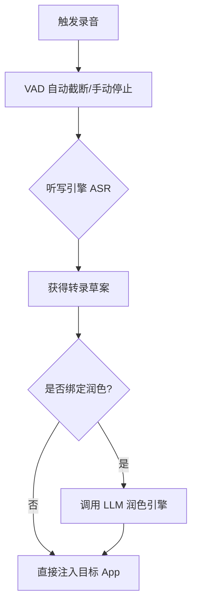

# 引擎架构与执行流水线 (Engines & Pipelines)

## 概要说明

本文档详述了 YakType 的核心执行引擎架构。通过将“语音识别 (ASR)”与“大模型润色 (LLM Polishing)”解耦，系统构建了一条原子化的处理流水线（Pipeline）。这种设计允许用户自由组合本地高性能引擎与云端深度语义引擎，以达到速度与准确度的平衡。

---

## 引擎类型及其计算边界

系统支持多种异构引擎，每种引擎在流水线中承担不同的角色。

### 1. 听写引擎 (Dictation Role)
听写引擎负责将原始音频号转换为初始文字草案（Raw Transcript）。

| 引擎名称 | 计算平台 | 处理特性 | 核心优势 |
| :--- | :--- | :--- | :--- |
| **Apple Native** | 设备端 (CPU/ANE) | 实时流式处理，完全离线。 | 零延迟、极高隐私、无费用。 |
| **Gemini / OpenAI** | 云端 (GPU Cluster) | 批量切片处理（Batching）。 | 语境识别能力极强，支持复杂纠错。 |
| **阿里云 (ASR)** | 云端 | 对中文特定方言、术语有深度优化。 | 中文复杂环境下识别率极高。 |

### 2. 润色引擎 (Polishing Role)
润色引擎通过 LLM 对听写草案进行二次加工。

*   **处理逻辑**：系统会将听写结果通过 `PromptTemplate` 包装，发送至指定的 LLM。
*   **功能项**：纠正同音字（的/地/得）、移除口语填充词（呃、那个）、根据上下文自动补全标点。

---

## 执行流水线 (The Pipeline)

### 1. 组合机制
用户可以定义多个 `ProcessingPipeline`。每个流水线包含：
*   **DictationProfile**：指定听写引擎实例。
*   **PolishingProfile**：可选。指定用于后处理的引擎及默认提示词模板。

### 2. 原子化执行序列
当一个流水线被触发时，系统会按以下确定的序列执行：

---

## 技术注意事项

*   **并行限制 (Concurrency)**：系统支持多个音频任务并发处理，但单次“实时听写”任务具有排他性，以防止 `Accessibility` 自动填充指令产生竞争。
*   **API 错误降级**：若润色引擎调用失败（如网络超时），系统会自动回退 (Fallback) 至原始听写草案并执行注入，以确保用户输入的连续性。
*   **缓存机制**：听写生成的音频切片临时存储在 `Library/Caches` 中，在流水线终结后根据 `AutoDeletePolicy` 进行管理。
