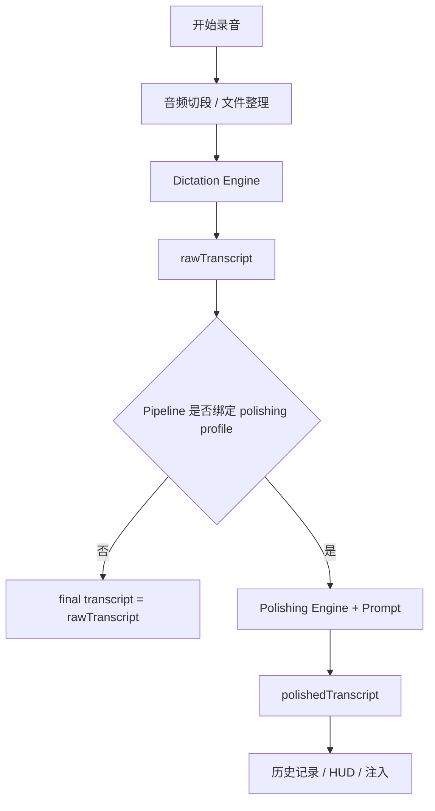

# 引擎架构与执行流水线 (Engines & Pipelines)

## 概要说明

本文档说明 YakType 当前代码中的引擎角色划分、支持的引擎类型、流水线绑定方式，以及 macOS 与 iOS 在流水线语义上的差异。重点是帮助理解“引擎实例”和“流水线实例”各自负责什么。

## 1. 角色划分

YakType 当前把处理链拆成两个角色：

### 1.1 听写引擎（Dictation）

职责：

- 接收音频
- 输出原始文本
- 驱动实时 segment 或整段文件转录

当前支持：

- `Apple`
- `Gemini`
- `AliCloud QwenASR`
- `Xiaomi MiMo ASR`

### 1.2 后处理引擎（Polishing）

职责：

- 接收听写文本
- 结合 prompt 进行润色、翻译或格式化

当前支持：

- `Gemini`
- `OpenAI (Compatible)`

## 2. 引擎实例与流水线实例

### 2.1 `EngineProfile`

`EngineProfile` 表示一个具体的引擎实例配置，例如：

- 一个绑定了特定模型的 Gemini 听写实例
- 一个使用 DeepSeek base URL 的 OpenAI Compatible 后处理实例

### 2.2 `ProcessingPipeline`

`ProcessingPipeline` 表示一条执行链：

- 一个 dictation profile
- 一个可选 polishing profile

因此流水线负责“怎么组合”，引擎实例负责“具体怎么调用”。

## 3. 当前支持的引擎矩阵

| 引擎 | Dictation | Polishing | 备注 |
| :--- | :--- | :--- | :--- |
| `Apple` | 是 | 否 | 本地原生听写 |
| `Gemini` | 是 | 是 | 当前唯一双能力引擎 |
| `AliCloud QwenASR` | 是 | 否 | 中文云端听写 |
| `Xiaomi MiMo ASR` | 是 | 否 | 云端听写 |
| `OpenAI (Compatible)` | 否 | 是 | 通用文本后处理 |

## 4. 执行链路

## 5. Prompt 的当前绑定方式

Prompt 当前不直接挂在流水线上，而是挂在 `EngineProfile.promptTemplateID` 上。

这意味着：

- 你切换的是“后处理引擎实例”
- 该实例自身再决定默认使用哪个 prompt

因此同一 Provider 可以通过多个 `EngineProfile` 实例体现不同的 prompt 语义。

## 6. macOS 与 iOS 的流水线差异

### 6.1 macOS

macOS 当前主要围绕默认流水线与引擎管理页工作，用户更容易从“引擎实例”视角理解系统。

### 6.2 iOS

iOS 当前已经固定为三条触发入口：

- 点击
- 左滑
- 右滑

它们对应三条物理流水线，因此 iOS 对流水线概念的感知更强。

## 7. 当前重要实现事实

### 7.1 默认种子

空库初始化后，系统会补齐：

- 一个 Apple 听写引擎
- 一个 Gemini 后处理引擎
- 至少一条默认流水线
- iOS 下再补齐左滑、右滑流水线

### 7.2 密钥解析

云端引擎支持：

- 内嵌 `apiKey`
- `ManagedKey` 引用

运行时由 service 层解析出最终密钥后再应用到引擎实例。

### 7.3 历史任务上下文

新任务的主要上下文已经是：

- 听写 profile ID
- 后处理 profile ID
- 听写 / 后处理引擎类型
- `pipelineIndex`

而不是 prompt 名称。

